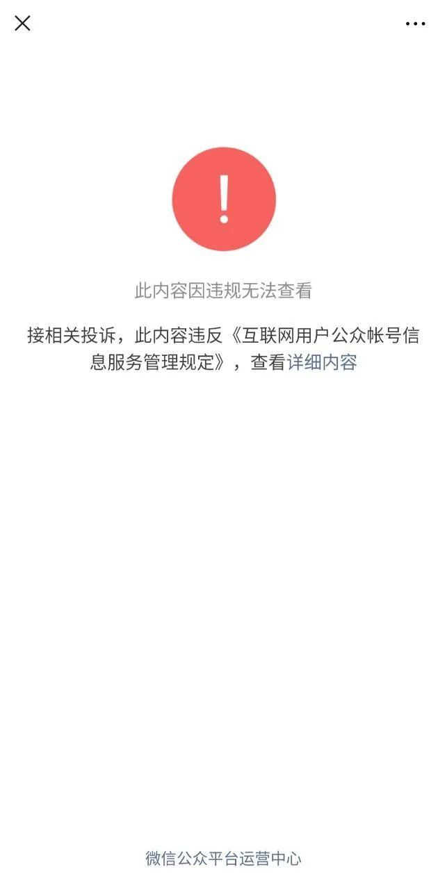

# 评论｜方方“交代”被删：造谣可以，辟谣无门

作者：1号床 - 黑羊公社（公众号二维码见文末）

原文转载自 [Matters](https://matters.news/@sgdfjw/%E8%AF%84%E8%AE%BA-%E6%96%B9%E6%96%B9-%E4%BA%A4%E4%BB%A3-%E8%A2%AB%E5%88%A0-%E9%80%A0%E8%B0%A3%E5%8F%AF%E4%BB%A5-%E8%BE%9F%E8%B0%A3%E6%97%A0%E9%97%A8-bafyreiau7t3ujsb4rt3zf3nv2agjsntpdd4xrzaobxwrt5kmolrmkzrxum)。

> **聽取另一方之陳詞 Audi alteram partem.**

> **——自然正義的基本原則**

我对谣言的态度一向很明确：**若非有明确的主观故意且造成严重的后果，否则公权力不应当肆意干涉**。关于这一点，我在先前一系列[关于吹哨人的文章](http://mp.weixin.qq.com/s?__biz=MzU2NTg3ODk5Mg==&mid=2247483824&idx=1&sn=1ab86b658eaa422d1c3b3d5512ea0122&chksm=fcb4480fcbc3c11958048d7121f7a51b328b20a606937e6f0b75c2f026cc9785443e1b7d3581&scene=21#wechat_redirect)中已经解释过了。一方面，「传谣」的当事人囿于客观能力和主观原因，不一定知道这是谣言，若因此将之置于被惩罚的危险中，恐将扼杀信息的自由流通；另一方面，舆论场是动态的，有造谣就有辟谣，这一对相反的作用力大体上可以维持平衡。

写完[关于方方日记的那篇对话体](http://mp.weixin.qq.com/s?__biz=MzU2NTg3ODk5Mg==&mid=2247483899&idx=1&sn=9d5ac92db2033beaaadb53df18633bdc&chksm=fcb44844cbc3c152ea8f65818acae2358eb14b3d176408a4e0ae327b4dec4ad37402f9453355&scene=21#wechat_redirect)之后，有读者就在后台留言，**说怎么不扒一扒方方家六套房子的事**。我觉得吧我又不是记者，哪有资源调查这种事。后来又看到各路文章，**扒她家庭、财产、过往经历，质疑她写日记的动机，说她造谣、卖国、勾结境外势力**。这么一轮攻击下来，我厚实的同温层朋友圈都微微表现出分裂的迹象了。

我比较相信正规媒体，因为他们好歹坚持新闻专业主义，**报道的消息总是比自媒体要可靠很多**。由于对方方的攻击大多是从自媒体上来的，所以我也就一直没怎么当回事。但是我寻思，面对铺天盖地的指控，方方应该会站出来回应一下吧。

回应如期而至。昨天晚上，我在朋友圈偶然看到了《财经》杂志旗下专栏一篇名为《[专访方方：如果我不「交代」，谣言就永远没完](./fangfang.md)》的文章，并有幸成为了其**最后一批读者**。

文章中对网上广为流传的一些质疑和指控进行了回应，可以说是十分全面了：

- **为什么《武汉日记》出版周期这么短？**
- **日记出版后收入会去哪？**
- **如何回应日记「道听途说」的指控？**
- **那张「满地手机」的图片是真是假？**
- **你是正厅级干部吗？你有六套房吗？**
- **日记的出版对你的生活和家人有什么影响？**

方方的种种「交代」都十分详细，她坦言：**「我写这些（回应），脑海中浮出我父亲当年写交代材料的场景，心中满是悲凉。**这原本是我的私事，我无需向公共交代这些，但是我不说，谣言就永远不止，我说了，谣言恐怕仍然不会停止。**」**

…...

但是过了十分钟之后再打开，便只剩下熟悉的界面了：

**真是莫名其妙：只听说过删除谣言的，没听说过删除回应的。**

我想起电影里经常有的那种场景，一个隔音的玻璃柜或者玻璃房，被关在里面的人怎么喊怎么拍，外面的人一点声音都听不到。被万人指控的方方，大概就处在这样一个玻璃房中吧。

我不知道这算不算是**扯下了为审查制度辩护者的遮羞布**。一直以来都有人告诉我们，中国幅员辽阔，人口很多，教育水平参差不齐，许多人没有判断能力。因此需要 censure，积极引导。

可是我们一次又一次地看到，只有「某些」谣言会消失，另外一些传播偏见的谣言却可以大行其道，经久不衰，甚至成为中国人世界观和生活方式的一部分。在必要的时候，连「辟谣」的文章都可以处理掉。迅速地处理掉。**这种审查制度下的「引导」真的能把我们引向一个更加有判断力更加理性的社会吗？**我着实不知道。

好在互联网是有记忆的。这篇文章发上新浪新闻之后，Google cache 保存了网页快照，在那里可以阅读全文：

https://webcache.googleusercontent.com/search?q=cache:yAcTYVJ3cm4J:https://news.sina.com.cn/s/2020-04-18/doc-iirczymi7059030.shtml+&cd=2&hl=zh-CN&ct=clnk&gl=in&lr=lang_zh-CN

（[原文备份](./fangfang.md)）

诉讼法的一大原则就是要让双方的陈述都能被法庭听取。**希望在舆论的审判席上，我们也能拥有程序正义。**

